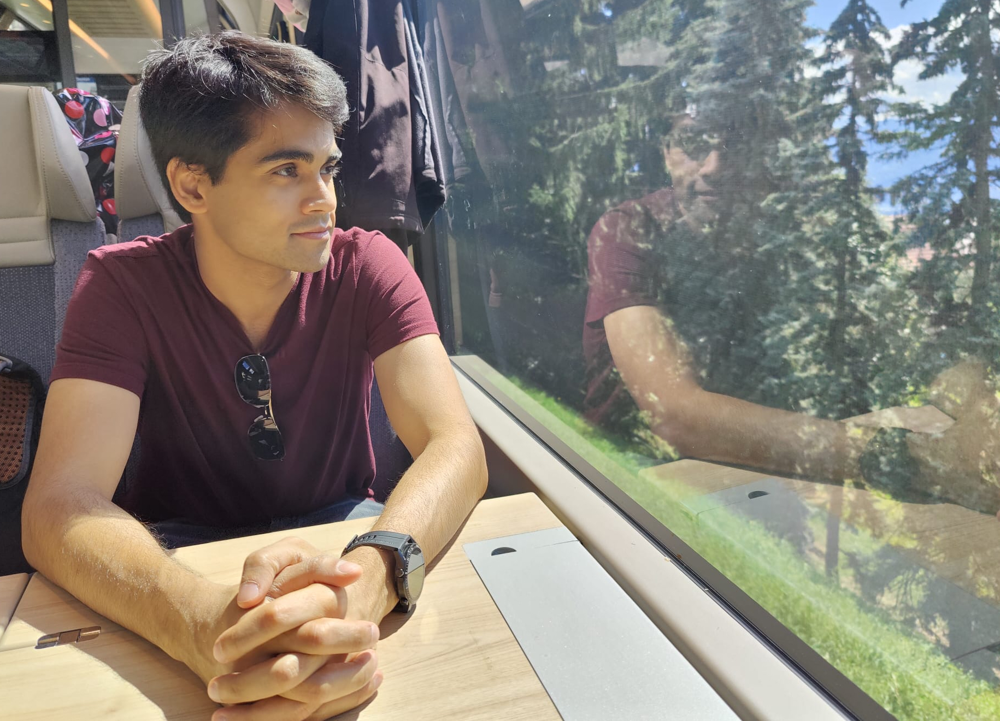

Hi! I am Anik (he/him/his), a final year [IMPRS](https://www.imprs-astro.mpg.de/content/about-imprs-astrophysics.html) doctoral student in Astrophysics at the [Observatory (USM)](https://www.usm.uni-muenchen.de/) of the Ludwig Maximilians University (LMU) Munich, Germany. I am advised by [Stella Seitz](https://www.usm.lmu.de/people/stella/stella.html) and work in the chair of [Extragalactic Astronomy](https://www.exgal.physik.uni-muenchen.de/index.html) at LMU led by [Ralf Bender](https://www.mpe.mpg.de/~bender/). I am also affiliated with the [OPINAS](https://www.mpe.mpg.de/opinas-en) research group at the Max Planck Institute for Extraterrestrial Physics (MPE), Garching, Germany.  

My research focus is on weak gravitational lensing and cosmology. Specifically, I work at the interface of theory and observations and focus on the development and modelling of practical higher-order weak lensing statistics (beyond conventional 2-point correlations) that can be measured easily from galaxy survey data and which hold the potential to bring improvements on the constraints of cosmological as well as astrophysical and systematic parameters relative to 2-point only analyses.  

Over the course of my research, I have been fortunate to work closely with my collaborators [Alex Barreira](https://www.origins-cluster.de/forschung/origins-fellows/barreira), Alexandre Barthelemy, [Oliver Friedrich](https://www.usm.lmu.de/~oliverf/), Zhengyangguang Gong, and [Daniel Gruen](https://www.physik.lmu.de/en/about-us/people/contact-page/gruen.html).

I was born and brought up in the town of Durgapur in West Bengal, India. After graduating from high school, I moved to Bremen, Germany in order to pursue a BSc in Physics.
During my undergraduate studies, I was the recipient of the [DAAD RISE Worldwide](https://www.daad.de/rise/en/rise-worldwide/) scholarship for two consecutive years which 
allowed me to pursue internships in astronomy at [St. Andrews](https://www.st-andrews.ac.uk/physics-astronomy/about/) and [Tenerife](https://www.iac.es/en).
The internships solidified my interest in astronomy and after obtaining my bachelor's degree, I moved to Munich to pursue an MSc in Astrophysics. 
While pursuing my master's, I worked part-time as a software developer in the
[Scientific Computing research group of the Heinz Maier-Leibnitz Zentrum (MLZ)](https://mlz-garching.de/englisch/science-und-projects/project-coordination/scientific-computing.html), Garching. I have been in Munich since and after my master's, I'm currently pursuing a PhD in Astrophysics at LMU. For more details please refer to my CV.

I love football and am a loyal supporter of Arsenal FC.
