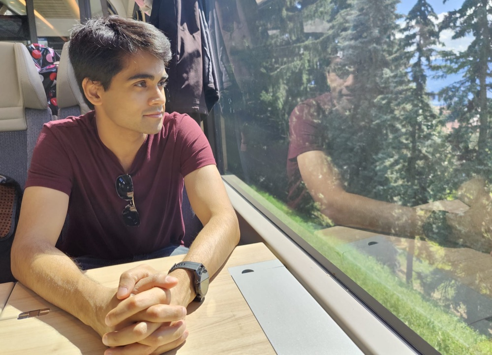

Hi! I am Anik (he/him), a Postdoctoral Research Associate at the [Institute of Astronomy](https://www.ast.cam.ac.uk/) and the [Kavli Institute for Cosmology](https://www.kicc.cam.ac.uk/), and a College Postdoctoral Associate at [Jesus College](https://www.jesus.cam.ac.uk/people/anik-halder), University of Cambridge.

My [research](research.md) focuses on understanding the large-scale structure of the cosmos using surveys that map the distribution of millions of galaxies. I work at the interface of galaxy populations and cosmology, bridging theory and observation. I develop higher-order statistics that capture the information in the non-Gaussian cosmic web beyond standard 2-point analyses. I develop and apply generative models of the galaxy population to infer the redshifts and physical properties of millions of galaxies in weak lensing surveys. I bring these together in multi-tracer analyses, using galaxy samples selected by their physical properties to connect galaxy evolution with cosmology.

I was born and raised in the town of Durgapur in West Bengal, India. In 2014 I moved to Germany to study physics at Bremen, where internships in [Aachen](https://www.ilt.fraunhofer.de/en.html), [St Andrews](https://www.st-andrews.ac.uk/physics-astronomy/about/) and [Tenerife](https://www.iac.es/en) began my research journey in physics and astronomy. I then moved to Munich for an MSc in Astrophysics, working alongside as a software developer at the [Heinz Maier-Leibnitz Zentrum](https://mlz-garching.de/englisch/science-und-projects/project-coordination/scientific-computing.html), and completed my PhD in Physics at the [University Observatory](https://www.physik.lmu.de/observatory/en/) of LMU Munich in 2024, advised by the late [Stella Seitz](https://www.usm.lmu.de/people/stella/stella.html) and [Ralf Bender](https://www.mpe.mpg.de/~bender/). I joined the University of Cambridge in November 2024.

Besides exploring the nature of physical reality through my research, I love poetry, am a passionate supporter of [Arsenal FC](https://www.arsenal.com) and I love walking! I have also volunteered extensively as a café retailer with the [Royal Voluntary Service](https://www.royalvoluntaryservice.org.uk/).

[Google Scholar](https://scholar.google.com/citations?user=HZm11dQAAAAJ&hl=en) &nbsp;·&nbsp; [ORCID](https://orcid.org/0000-0002-0352-9351) &nbsp;·&nbsp; [GitHub](https://github.com/anikhalder) &nbsp;·&nbsp; [LinkedIn](https://www.linkedin.com/in/anikhalder/)
