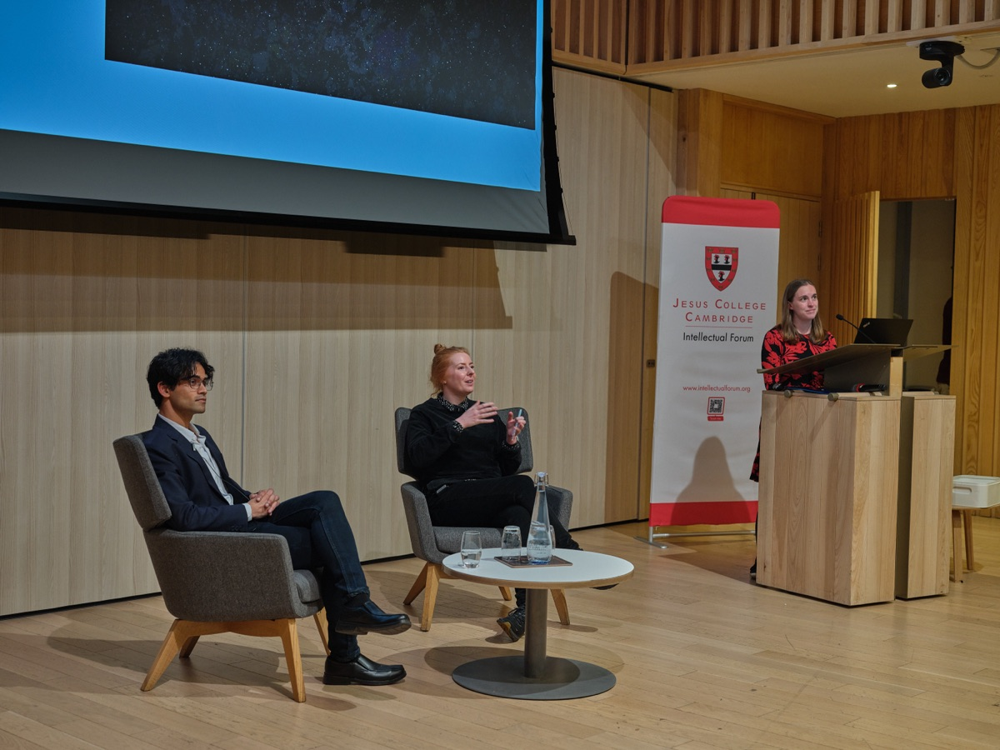
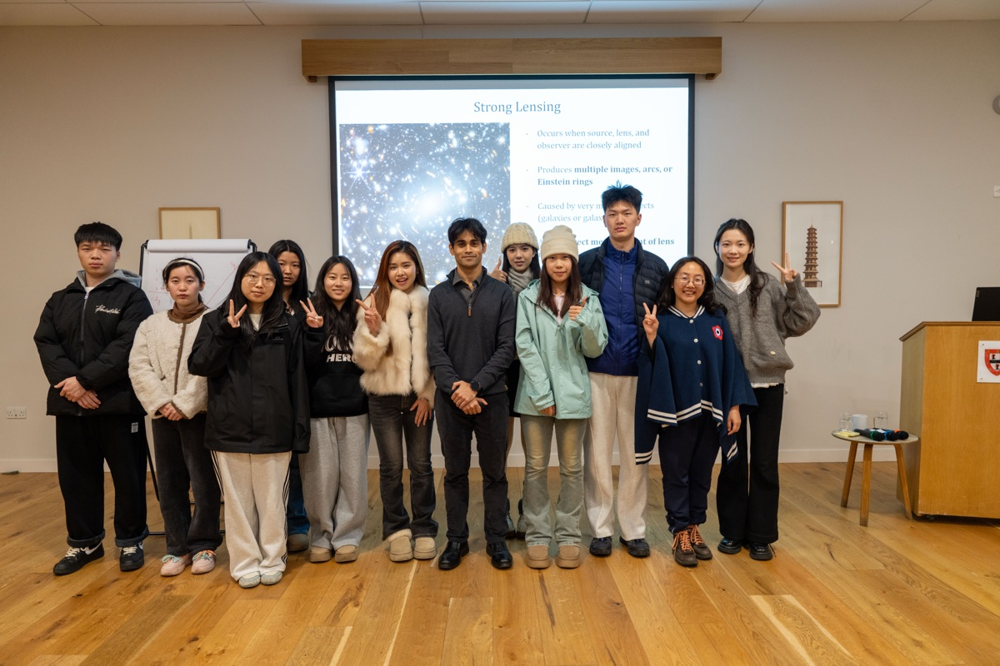

I enjoy taking cosmology to audiences outside astronomy, usually by working with people from other disciplines. Below are the projects and talks I am involved in.

### Earth, a Cosmic Spectacle

*picture courtesy: John Hooper*

I collaborate with [Louise Beer](https://www.louisebeer.com), Artist in Residence at the Institute of Astronomy, on her project *Earth, a Cosmic Spectacle*. The project uses photography, sound and conversation to connect audiences to the history of the Earth and to the climate crisis. My part is the cosmological one: how the Universe evolved, and the chain of events that led to life on this planet.

- *Earth, a Cosmic Spectacle*, **Intellectual Forum, Jesus College, University of Cambridge**, March 2026. Louise presented the project and I joined her on stage for the discussion that followed. [Recording](https://www.youtube.com/watch?v=KYtO5j9uDeA)
- *Earth, a Cosmic Spectacle: expert panel*, **Everybody Arts, Halifax**, January 2026. An online panel with Louise and Miranda Lowe CBE, Principal Curator at the Natural History Museum, chaired by Sammi Lukic-Scott, accompanying the exhibition at the Everybody Gallery. [Recording](https://www.everybodyarts.org.uk/news/eacs-panel)

&nbsp;

&nbsp;

### life &#124; TIME

[Miranda Robbins](https://www.jesus.cam.ac.uk/people/miranda-robbins), a neuroscientist at the University of Cambridge and Jesus College, and I are convening a three-part panel series, funded by the College's [Intellectual Forum](https://www.jesus.cam.ac.uk/research/intellectual-forum). It asks what endures, what fades, and what we inherit across biological, cosmic and economic time, bringing scientists, humanities scholars and policy voices into conversation. The series runs in 2027.

&nbsp;

&nbsp;

### Selected talks

*picture courtesy: Young, a participant of the Wuhan College programme*

- *Gravity as a cosmic lens*, **Jesus College, University of Cambridge**, January 2026. An introduction to gravitational lensing for students visiting from Wuhan College, China, on their winter exchange programme.
