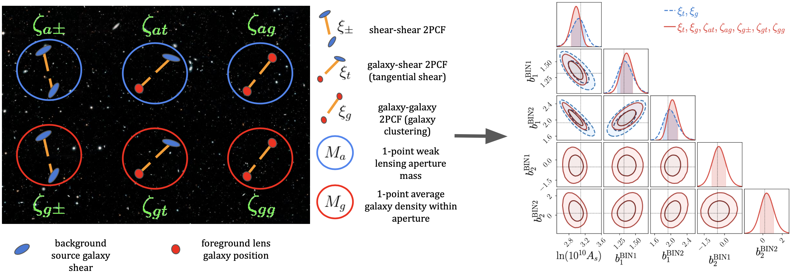
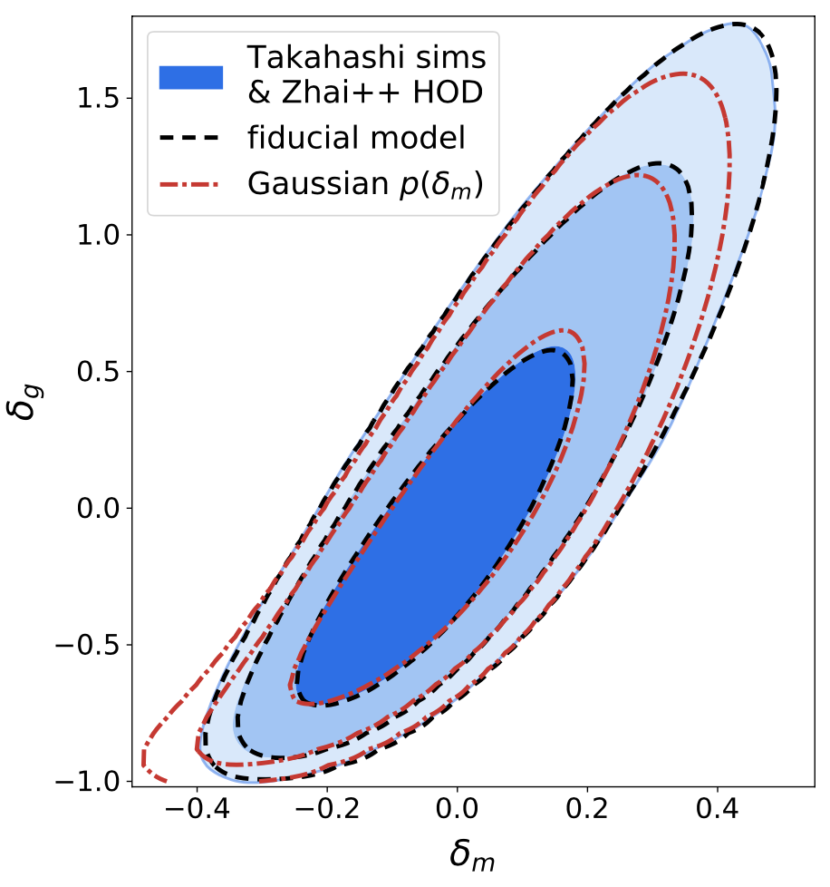
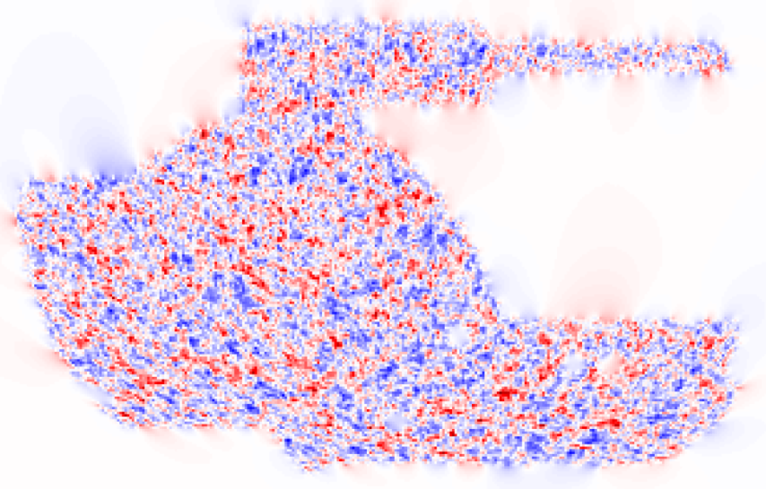

Over the course of my Bachelor's, Master's and ongoing Ph.D. education I have had the opportunity to work on several short and long-term research projects in various topics in Physics through internships, research assitantships or thesis projects (please refer to my [CV](cv/AnikHalder_CV.pdf) for details). I have worked mainly on analytical and computational projects in the fields of laser optics, planetary science, geosciences, nonlinear dynamics, x-ray reflectometry and of course, astrophysics. 

Here, I present some of my current research projects in weak lensing cosmology and their associated publications:

### The integrated 3-point correlation function of projected cosmic density fields

In this series of works we have developed a set of practical higher-order statistics called the *integrated 3-point correlation functions* which can be easily measured from galaxy imaging data alongside conventional 2-point statistical methods and has the potential to put tighter constraints on cosmological, galaxy bias as well as baryonic feedback parameters (see image above; courtesy: *Halder et al. 2023*). This statistic measures the *position-dependent* 2-point correlation functions of a field (e.g. 3 x 2-point galaxy-lensing correlations) inside a local 2D patch and correlates them with the 1-point average shear or galaxy density within the same patch. This correlation admits a very well-defined physical interpretation as the modulation of the small-scale 2PCFs by long-wavelength features of the field and in turn is sensitive to the higher-order squeezed bispectrum configurations (3-point function) of the field. Using semi-analytical methods based on perturbation theory for accurately modelling this statistic along with the inclusion of galaxy bias, intrinsic alignments, baryonic feedback effects as well as other nuisance parameters, we have extensively validated our models against N-body simulations and with state-of-the art machine learning neural networks developed fast inference pipelines for their application to galaxy survey data. We are currently analysing this statistic in the Dark Energy Survey's Year 3 data.

**Halder**, Friedrich, Seitz, Varga (2021)\
*The integrated 3-point correlation function of cosmic shear*\
[arXiv:2102.10177](https://arxiv.org/abs/2102.10177) &nbsp; [MNRAS](https://academic.oup.com/mnras/article-abstract/506/2/2780/6309317?redirectedFrom=fulltext)

**Halder**, Barreira (2022)\
*Response approach to the integrated shear 3-point correlation function: the impact of baryonic effects on small scales*\
[arXiv:2201.05607](https://arxiv.org/abs/2201.05607) &nbsp; [MNRAS](https://academic.oup.com/mnras/article-abstract/515/3/4639/6648837?redirectedFrom=fulltext&login=false)

Gong, **Halder**, Barreira, Seitz, Friedrich (2023)\
*Cosmology from the integrated shear 3-point correlation function: simulated likelihood analyses with machine-learning emulators*\
[arXiv:2304.01187](https://arxiv.org/abs/2304.01187) &nbsp; [JCAP](https://iopscience.iop.org/article/10.1088/1475-7516/2023/07/040)

**Halder**, Gong, Barreira, Friedrich, Seitz, Gruen (2023)\
*Beyond 3x2-point cosmology: the integrated shear and galaxy 3-point correlation functions*\
[arXiv:2305.17132](https://arxiv.org/abs/2305.17132) &nbsp; JCAP (accepted)

&nbsp;

### The joint PDF of galaxy and matter density fluctiations

Along with my collaborators I have worked on modelling the 1-point joint PDF of 3D matter and galaxy density fluctuations (see image on the left; courtesy: *Friedrich et al. 2022*). Conventional 2-point analysis tools would compress this joint PDF into just 3 quantities: the variance of matter density fluctuations, the variance of galaxy density fluctuations and their cross-covariance. In this work we developed a model for the full shape of the joint galaxy-matter PDF and extensively validated it using N-body simulations and mock Halo Occupation Distribution (HOD) galaxy catalogs. Studying the full shape of the 1-point PDF is another way to go beyond 2-point analyses and enables further insights into the nature of the cosmic web of structures, especially on cosmological as well as galaxy bias and stochasticity parameters. We are currently extending our modelling to perform a joint-PDF analysis using CMB lensing data from SPT and DESY3 lens galaxies.

Friedrich, **Halder**, Boyle, Uhlemann, Britt, Codis, Gruen, Hahn (2022)\
*The PDF perspective on the tracer-matter connection: Lagrangian bias and non-Poissonian shot noise*\
[arXiv:2107.02300](https://arxiv.org/abs/2107.02300) &nbsp; [MNRAS](https://academic.oup.com/mnras/article/510/4/5069/6505138?login=true)

&nbsp;

### Modelling the Kaiser-Squires reconstructed lensing convergence PDF under realistic survey masks

In weak lensing surveys the lensing convergence field (can be thought of as the line-of-sight projected mass map) itself is not a direct observable. However, the more directly observable cosmic shear field is related to the convergence through a convolution and hence it can be reconstructed from the shear through a technique called the Kaiser-Squires (KS) inversion (see image on the left; courtesy: *Barthelemy et al. 2023*). One big challenge to this KS inversion is that the reconstruction procedure is non-local and hence is exact only if one has access to the cosmic shear field at every location on the sky, which is of course unfeasible in the presence of survey masks. Hence, a vanilla KS convergence reconstruction severely suffers from masking effects. In this work we presented an accurate analytical model of the KS reconstructed convergence PDF under a DESY3-like survey mask and validated it with N-body simulations. We also discussed the modelling of several systematic effects into the reconstructed PDF including galaxy intrinsic alignments, additive and multiplicative shear biases, photometric redshift uncertainties and higher-order lensing corrections. This is our first work in a series of papers on the KS convergence PDF and in upcoming works we plan to demonstrate the robustness of our theoretical modelling through simulated likelihood analyses as well as measure and analyse the reconstructed convergence PDF from DESY3 cosmic shear data.

Barthelemy, **Halder**, Gong, Uhlemann (2023)\
*Making the leap I: Modelling the reconstructed lensing convergence PDF from cosmic shear with survey masks and systematics*\
[arXiv:2307.09468](https://arxiv.org/abs/2307.09468) &nbsp; JCAP (submitted)
