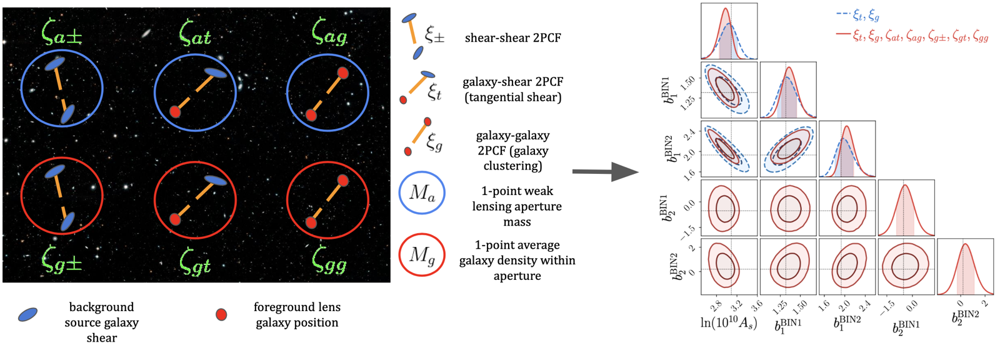
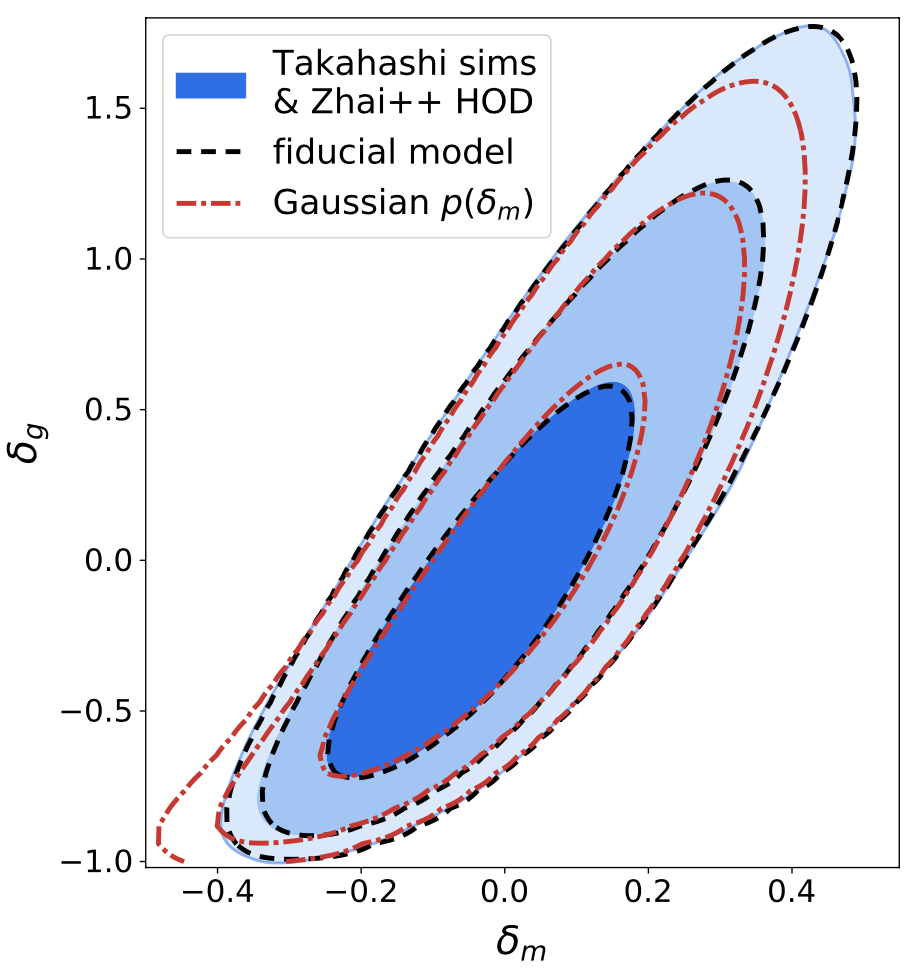

Over the course of my Bachelor's, Master's and Ph.D. I have had the opportunity to work on several short and long-term research projects on various topics in Physics through internships, research assistantships or thesis projects (please refer to my [CV](cv/AnikHalder_CV.pdf) for details). I have worked mainly on analytical and computational projects in the fields of laser optics, planetary and space science, geosciences, x-ray reflectometry, and of course, astrophysics. Please refer to my [Google Scholar](https://scholar.google.com/citations?user=HZm11dQAAAAJ&hl=en) profile for a full list of publications that I am involved in.

Here, I present some of my current research projects in weak lensing cosmology and galaxy evolution and their associated publications:

### pop-cosmos: from galaxy populations to cosmology

[pop-cosmos](https://github.com/Cosmo-Pop/pop-cosmos) is a generative model for the evolving galaxy population, calibrated on deep multi-wavelength photometry from COSMOS2020. It provides a physically motivated prior over the galaxy population up to redshift *z* ≈ 6 in stellar population synthesis parameter space. Using this prior with an emulator for stellar population synthesis and GPU-accelerated sampling, we have inferred joint posteriors on the redshifts and physical properties (such as stellar mass and star-formation rate) of 4 million galaxies in the Kilo-Degree Survey (KiDS-1000). This is the first principled Bayesian inference of galaxy properties for a wide-area weak lensing survey. We validated the redshifts against around 185,000 KiDS galaxies with DESI spectroscopic redshifts. The same galaxy population model also forward-models the KiDS-1000 redshift distributions directly, without spectroscopic reweighting. With these catalogues we can select galaxy samples by their physical properties rather than by colour proxies, which opens the way to weak lensing and multi-tracer analyses with better control of systematic effects such as intrinsic alignments.

**Halder**, Peiris, Thorp, Leistedt, Mortlock, Jagwani, Tudorache, Deger, Van den Bussche, Leja, Wright (2026)\
*pop-cosmos: Redshifts and physical properties of KiDS-1000 galaxies*\
[arXiv:2602.03930](https://arxiv.org/abs/2602.03930) &nbsp; [MNRAS](https://doi.org/10.1093/mnras/stag1590)

Leistedt, Peiris, **Halder**, Thorp, Mortlock, Loureiro, Alsing, Jagwani, Tudorache, Deger, Leja, Van den Bussche, Wright, Li, Kuijken, Hildebrandt (2026)\
*pop-cosmos: Forward modeling KiDS-1000 redshift distributions using realistic galaxy populations*\
[arXiv:2602.03935](https://arxiv.org/abs/2602.03935)

Thorp, Peiris, Jagwani, Deger, Alsing, Leistedt, Mortlock, **Halder**, Leja (2025)\
*pop-cosmos: Insights from generative modeling of a deep, infrared-selected galaxy population*\
[arXiv:2506.12122](https://arxiv.org/abs/2506.12122) &nbsp; [ApJ](https://doi.org/10.3847/1538-4357/ae0936)

Van den Bussche, Deger, Peiris, Thorp, Mortlock, Leistedt, **Halder**, Tudorache, Jagwani (2026)\
*pop-cosmos: Disentangling galaxy properties from observables using data-driven approaches*\
[arXiv:2606.11308](https://arxiv.org/abs/2606.11308)

Tudorache, Peiris, Thorp, Deger, Mortlock, Jagwani, **Halder**, Leistedt, Van den Bussche, Leja (2026)\
*pop-cosmos: Galaxy size evolution across structural and star-formation classifications in COSMOS-Web*\
[arXiv:2606.28489](https://arxiv.org/abs/2606.28489)

&nbsp;

### The integrated 3-point correlation functions

In this series of works we have developed a set of practical higher-order statistics called the *integrated 3-point correlation functions* which can be easily measured from galaxy imaging data alongside conventional 2-point statistical methods and has the potential to put tighter constraints on cosmological, galaxy bias as well as baryonic feedback parameters (see image above; courtesy: *Halder et al. 2023*). This statistic measures the *position-dependent* 2-point correlation functions of a field (e.g. 3 x 2-point galaxy-lensing correlations) inside a local 2D patch and correlates them with the 1-point average shear or galaxy density within the same patch. This correlation admits a very well-defined physical interpretation as the modulation of the small-scale 2PCFs by long-wavelength features of the field and in turn is sensitive to the higher-order squeezed bispectrum configurations (3-point function) of the field. Using semi-analytical methods based on perturbation theory for accurately modelling this statistic along with the inclusion of galaxy bias, intrinsic alignments, baryonic feedback effects as well as other nuisance parameters, we have extensively validated our models against N-body simulations and with state-of-the art machine learning neural networks developed fast inference pipelines for their application to galaxy survey data (which we are currently undertaking). We are also extending this to a simulation based inference framework.

**Halder**, Friedrich, Seitz, Varga (2021)\
*The integrated 3-point correlation function of cosmic shear*\
[arXiv:2102.10177](https://arxiv.org/abs/2102.10177) &nbsp; [MNRAS](https://academic.oup.com/mnras/article-abstract/506/2/2780/6309317?redirectedFrom=fulltext)

**Halder**, Barreira (2022)\
*Response approach to the integrated shear 3-point correlation function: the impact of baryonic effects on small scales*\
[arXiv:2201.05607](https://arxiv.org/abs/2201.05607) &nbsp; [MNRAS](https://academic.oup.com/mnras/article-abstract/515/3/4639/6648837?redirectedFrom=fulltext&login=false)

Gong, **Halder**, Barreira, Seitz, Friedrich (2023)\
*Cosmology from the integrated shear 3-point correlation function: simulated likelihood analyses with machine-learning emulators*\
[arXiv:2304.01187](https://arxiv.org/abs/2304.01187) &nbsp; [JCAP](https://iopscience.iop.org/article/10.1088/1475-7516/2023/07/040)

**Halder**, Gong, Barreira, Friedrich, Seitz, Gruen (2023)\
*Beyond 3x2-point cosmology: the integrated shear and galaxy 3-point correlation functions*\
[arXiv:2305.17132](https://arxiv.org/abs/2305.17132) &nbsp; [JCAP](https://iopscience.iop.org/article/10.1088/1475-7516/2023/10/028)

Gebauer, **Halder**, Seitz, Anbajagane (2025)\
*𝚂𝙱𝚒𝟹𝙿𝙲𝙵: Simulation-based inference with the integrated 3PCF*\
[arXiv:2510.13805](https://arxiv.org/abs/2510.13805) &nbsp; [JCAP](https://doi.org/10.1088/1475-7516/2026/06/036)

Gomes, Sugiyama, et al. incl. **Halder** (DES Collaboration, 2025)\
*Dark Energy Survey Year 3 Results: Cosmological constraints from second- and third-order shear statistics*\
[arXiv:2508.14018](https://arxiv.org/abs/2508.14018) &nbsp; [PRD](https://doi.org/10.1103/sxlz-t9gb)

&nbsp;

### The PDF of cosmic density fluctuations

Along with my collaborators I have worked on modelling the 1-point PDF of weak lensing convergence as well as the joint PDF of 3D matter and galaxy density fluctuations (see image on the left; courtesy: *Friedrich et al. 2022*). Conventional 2-point analysis tools would compress this joint PDF into just 3 quantities: the variance of matter density fluctuations, the variance of galaxy density fluctuations, and their cross-covariance. In this work, we developed a model for the full shape of the joint galaxy-matter PDF and extensively validated it using N-body simulations and mock Halo Occupation Distribution (HOD) galaxy catalogs. Studying the full shape of the 1-point PDF is another way to go beyond 2-point analyses and enables further insights into the nature of the cosmic web of structures, especially on cosmological as well as galaxy bias and stochasticity parameters. We are currently extending our modelling to perform a joint-PDF analysis using CMB lensing data from SPT and DESY3 lens galaxies. 

Friedrich, **Halder**, Boyle, Uhlemann, Britt, Codis, Gruen, Hahn (2022)\
*The PDF perspective on the tracer-matter connection: Lagrangian bias and non-Poissonian shot noise*\
[arXiv:2107.02300](https://arxiv.org/abs/2107.02300) &nbsp; [MNRAS](https://academic.oup.com/mnras/article/510/4/5069/6505138?login=true)

Barthelemy, **Halder**, Gong, Uhlemann (2024)\
*Making the leap I: Modelling the reconstructed lensing convergence PDF from cosmic shear with survey masks and systematics*\
[arXiv:2307.09468](https://arxiv.org/abs/2307.09468) &nbsp; [JCAP](https://iopscience.iop.org/article/10.1088/1475-7516/2024/03/060)

Friedrich, Castiblanco, **Halder**, Uhlemann (2025)\
*Bye binormal: analysing the joint PDF of galaxy density and weak lensing convergence*\
[arXiv:2507.16957](https://arxiv.org/abs/2507.16957) &nbsp; [MNRAS](https://academic.oup.com/mnras/article/545/4/staf2181/8408449)

&nbsp;